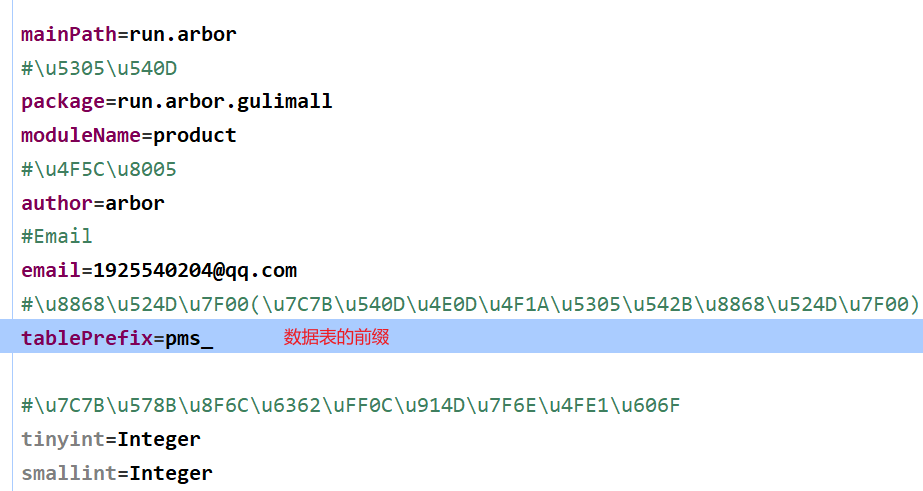
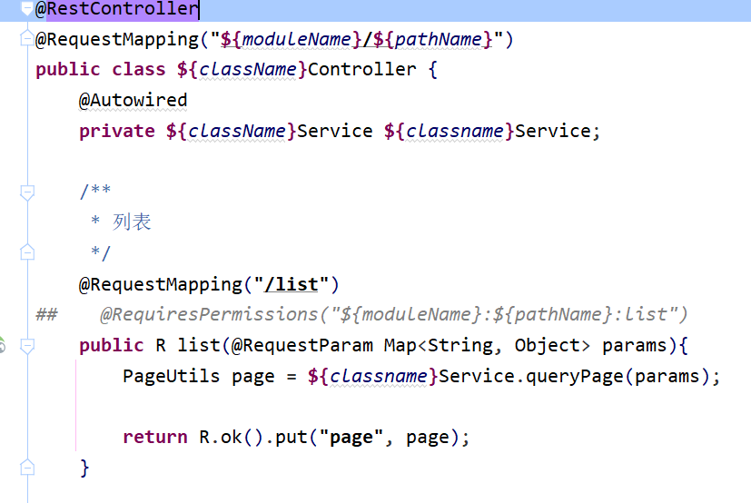

# 一、使用开源项目

在gitee上的项目，快速开发前端：[人人开源 (gitee.com)](https://gitee.com/renrenio)

克隆这两个项目：


把两个项目里面的git文件夹删除，然后将项目拷贝到父项目中


将renren-fast项目加入到idea的pom文件中


创建后台管理系统数据库：


修改项目中的数据源：


这里需要在url后面加上`&useSSL=false`，MySQL才不会报错

pom文件爆红的话执行里面的命令，反正我是执行这个，这个插件才不红的


运行前端：

控制台执行命令：(下载需要用的组件)

```bash
cnpm install
```


启动项目：

```bash
npm run dev
```


管理员账号密码：

admin admin


# 二、逆向工程搭建

下载代码生成器源码：


修改数据库地址：


修改基本信息：




可以在这个文件夹修改想要修改的部分：


比如在生成controller时，不需要shiro框架的@RequiresPermissions注解




启动代码生成项目，全选所有表，然后点击生成代码：


将生成的main文件夹放入`gulimall-product`项目中


创建一个通用模块，用于做其他模块的父工程，然后让`gulimall-product`项目引入该依赖：

```xml
<dependency>
    <groupId>run.arbor.gulimall</groupId>
    <artifactId>gulimall-common</artifactId>
    <version>0.0.1-SNAPSHOT</version>
</dependency>
```


将common工程所需要的依赖加上，并且导入product相关的依赖以及工具类：


## 整合mybatis-plus

product工程整合mybatis-plus：

### 1. 导入依赖

公共工程已经有了，所以不用导入了

```xml
<!-- mybatis-plus -->
<dependency>
    <groupId>com.baomidou</groupId>
    <artifactId>mybatis-plus-boot-starter</artifactId>
    <version>3.5.1</version>
</dependency>
```

### 2. 配置

#### 配置数据源

因为后面微服务都需要配置，所以驱动可以放在common服务里面

MySQL8.0的版本兼容5.7的版本  所以选择8.0的版本


```xml
<!-- MySQL -->
<dependency>
    <groupId>mysql</groupId>
    <artifactId>mysql-connector-java</artifactId>
    <version>8.0.28</version>
</dependency>
```


在application.yml中配置数据源：

```yml
spring:
  datasource:
    driver-class-name: com.mysql.jdbc.Driver
    url: jdbc:mysql://192.168.120.10:3306/gulimall_pms
    username: root
    password: root
```


#### 配置mybatis-puls

开启注解扫描，启动类上添加：

```java
@MapperScan("run.arbor.gulimall.product.dao")
```


告诉mybatis-puls，SQL的映射文件位置：

```yml
mybatis-plus:
  mapper-locations: classpath:/mapper/**/*.xml
```


#### 设置主键自增

```yml
mybatis-plus:
  mapper-locations: classpath:/mapper/**/*.xml
  global-config:
    db-config:
      id-type: auto
```


# 三、创建所有微服务基本代码

修改MySQL配置：


修改数据库表名前缀和项目名：


启动项目，全选所有表，生成代码：


将main文件夹复制到对应的微服务中，并添加依赖：

```xml
<dependency>
    <groupId>run.arbor.gulimall</groupId>
    <artifactId>gulimall-common</artifactId>
    <version>0.0.1-SNAPSHOT</version>
</dependency>
```


修改yml文件配置：

```yml
spring:
  datasource:
    driver-class-name: com.mysql.jdbc.Driver
    url: jdbc:mysql://192.168.120.10:3306/gulimall_sms
    username: root
    password: root
mybatis-plus:
  mapper-locations: classpath:/mapper/**/*.xml
  global-config:
    db-config:
      id-type: auto
server:
  port: 10000
```


